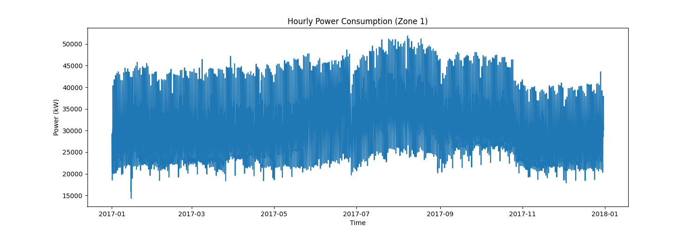
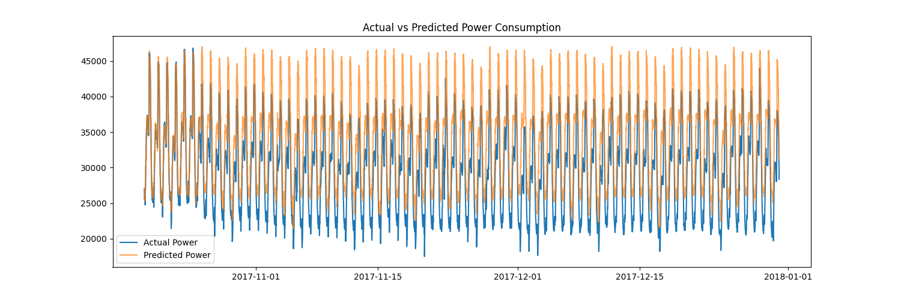

# Data Center Power Consumption Prediction

Machine Learning project to predict power consumption in data centers using environmental and time-series features.

## Project Overview
Data centers consume large amounts of electricity. Predicting energy demand helps operators manage resources efficiently and reduce operational costs.

This project uses machine learning to forecast power consumption based on environmental conditions and time-based patterns.

## Dataset Features
The dataset includes the following variables:

- Datetime
- Temperature
- Humidity
- Wind Speed
- Power Consumption (Zone 1)

## Technologies Used
- Python
- Pandas
- NumPy
- Matplotlib
- Seaborn
- Scikit-learn
- XGBoost

## Machine Learning Pipeline
1. Data Loading
2. Exploratory Data Analysis (EDA)
3. Feature Engineering
4. Train-Test Split
5. XGBoost Model Training
6. Model Evaluation
7. Future Power Prediction

## Model Performance
- R² Score: 0.41
- RMSE: ~4706

## Example Prediction
The trained model can predict future power demand based on environmental inputs.

Example output:

Predicted Power Consumption: 35413 kW

## Future Improvements
- Deep Learning (LSTM) for time-series forecasting
- Energy consumption dashboard
- Model optimization

## Visualization

### Power Consumption Trend

### Actual vs Predicted Power Consumption

## Author
Karthik
